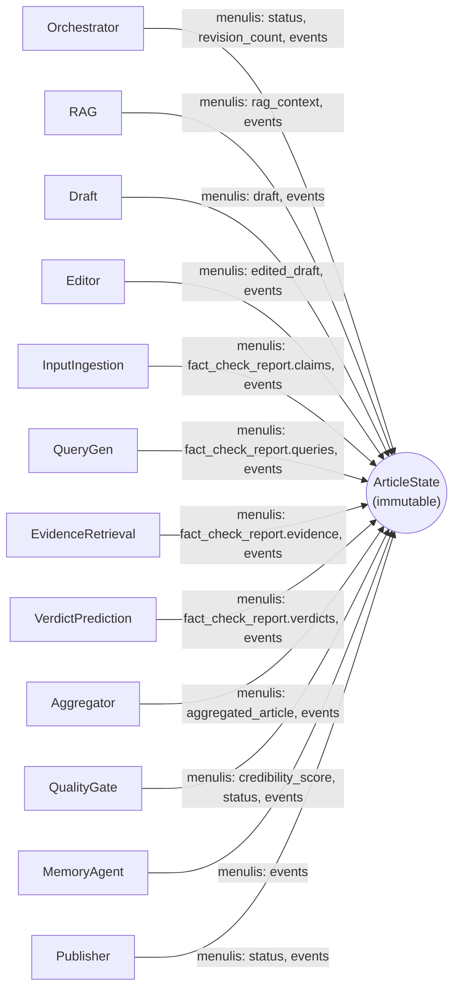
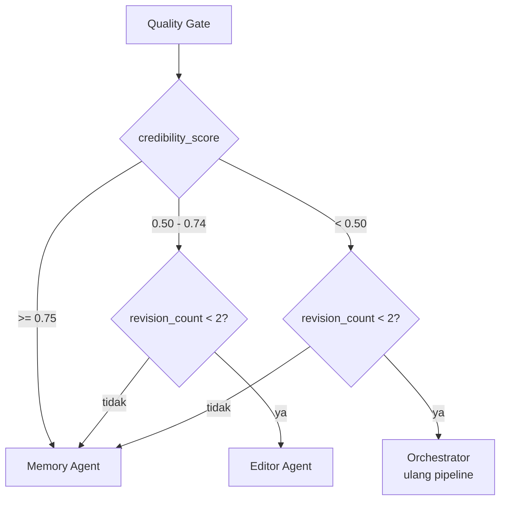

# 🏗️ Arsitektur Detail — NewsAgent

## Daftar Isi

- [Mengapa HMAS, Bukan Flat MAS?](#mengapa-hmas-bukan-flat-mas)
- [Mengapa LangGraph?](#mengapa-langgraph-bukan-crewai-atau-autogen)
- [Desain LLM Adapter Layer](#desain-llm-adapter-layer)
- [Desain Immutable State](#desain-immutable-state)
- [Desain Fact-Check Pipeline](#desain-fact-check-pipeline)
- [Desain Debate + Consensus](#desain-debate--consensus-aggregator)
- [Desain Credibility Scoring](#desain-credibility-scoring-quality-gate)
- [Keputusan yang Disengaja Ditunda](#keputusan-yang-disengaja-ditunda)


Dokumen ini menjelaskan keputusan-keputusan arsitektur utama NewsAgent secara mendalam. Untuk gambaran umum, lihat [README.md](../README.md).

---

## Mengapa HMAS, Bukan Flat MAS?

NewsAgent menggunakan **Hierarchical Multi-Agent System (HMAS)** — bukan flat MAS di mana semua agen setara.

Alasannya sederhana: bayangkan 10 jurnalis tanpa redaktur. Semua bisa ngobrol satu sama lain, tapi tidak ada yang memimpin. Kacau. HMAS memberikan struktur yang jelas:

```
Level 1: Orchestrator        (pemimpin redaksi)
Level 2: Agen Spesialis      (reporter & editor)
Level 3: Sub-Agen            (asisten spesifik)
```

Pola hierarki ini memberikan struktur komando yang jelas tanpa bottleneck di satu titik.

---

## Mengapa LangGraph, Bukan CrewAI atau AutoGen?

| Kriteria | LangGraph | CrewAI | AutoGen |
|---|---|---|---|
| Kontrol alur kerja | Penuh (graph-based) | Terbatas | Sedang |
| State management | Eksplisit & immutable | Implisit | Implisit |
| Debugging | Mudah (visual graph) | Sulit | Sedang |
| Custom workflow | Sangat fleksibel | Terbatas | Sedang |
| Integrasi LangSmith | Native | Tidak | Tidak |

LangGraph dipilih karena memberikan kontrol penuh atas alur kerja — kritis untuk sistem yang harus dapat diaudit seperti NewsAgent.

---

## Desain LLM Adapter Layer

Prinsip: **agen tidak boleh tahu LLM apa yang dipakai.**

```python
# Semua agen hanya tahu interface ini
class BaseLLMAdapter(ABC):
    async def complete(
        self, prompt: str, system: str | None = None,
        max_tokens: int = 2048,
    ) -> str: ...
    async def complete_structured(
        self, prompt: str, schema: dict,
        system: str | None = None, max_tokens: int = 2048,
    ) -> dict: ...

# Provider spesifik di-inject saat runtime
class ClaudeAdapter(BaseLLMAdapter): ...
class OpenAIAdapter(BaseLLMAdapter): ...
class GeminiAdapter(BaseLLMAdapter): ...
class MistralAdapter(BaseLLMAdapter): ...
class DeepSeekAdapter(BaseLLMAdapter): ...
class QwenAdapter(BaseLLMAdapter): ...
class HuggingFaceAdapter(BaseLLMAdapter): ...
```

Setiap agen bisa dikonfigurasi pakai LLM berbeda via `.env` — agen kompleks pakai model besar, agen sederhana pakai model ringan untuk hemat biaya. Parameter `max_tokens` diatur per-agent agar budget token proporsional dengan beban kerja.

### Fallback Adapter

Saat provider utama kehabisan kuota (429/402), `FallbackAdapter` otomatis mencoba provider berikutnya:

```python
# LLM_FALLBACK_CHAIN=gemini,openrouter,hf
# FallbackAdapter coba Gemini -> OpenRouter -> HuggingFace
class FallbackAdapter(BaseLLMAdapter):
    def __init__(self, adapters: list[BaseLLMAdapter]): ...
    # complete() coba adapter[0], jika exception -> adapter[1], dst
```

Konfigurasi via env `LLM_FALLBACK_CHAIN=gemini,openrouter,hf`. Setiap agen punya chain sendiri — pipeline tetap jalan meski satu provider down.

---

## Desain Immutable State

State antar agen bersifat **immutable** — agen tidak mengubah state yang ada, mereka membuat state baru.

```python
class ArticleState(TypedDict):
    article_id: str
    input_type: str            # "headline" | "url" | "text"
    raw_input: str
    rag_context: str           # diisi RAG Pipeline
    draft: str                 # diisi Draft Agent
    fact_check_report: dict    # diisi Fact-Check Pipeline
    edited_draft: str          # diisi Editor Agent
    aggregated_article: str    # diisi Aggregator
    credibility_score: float   # diisi Quality Gate
    status: str                # processing | published | review | failed
    revision_count: int        # counter pipeline restart (max 2)
    events: list[dict]         # append-only event log
```

Mengapa immutable? Karena pipeline multi-agen yang paralel rentan race condition jika state bisa diubah sembarang agen. Dengan immutable state + event sourcing, setiap langkah pipeline bisa di-replay dan di-audit.

---

## Desain Fact-Check Pipeline

Dipecah menjadi 4 sub-agen spesialis (bukan 1 agen monolitik):

```
Input Ingestion → Query Generation → Evidence Retrieval → Verdict Prediction
```

Mengapa 4 sub-agen lebih baik dari 1?
- Tiap sub-agen punya satu tanggung jawab (Single Responsibility)
- Lebih mudah di-debug: tahu persis di mana pipeline gagal
- Lebih mudah diganti: bisa swap Evidence Retrieval tanpa sentuh yang lain
- Terbukti lebih akurat vs monolitik (pendekatan multi-agent)

---

## Desain Debate + Consensus (Aggregator)

Alih-alih merge output secara mekanis, Aggregator menjalankan "ronde debat":

```
Ronde 1: Setiap agen beri penilaian INDEPENDEN
         (Draft Agent, Fact-Check, Editor membaca artikel final)
         ↓
Deteksi konflik: ada klaim yang bertentangan?
         ↓
Ronde 2: Agen berdebat pada poin konflik
         ↓
Sintesis konsensus → artikel final
```

Hasilnya lebih akurat karena konflik terdeteksi sebelum artikel tayang, bukan sesudah.

---

## Desain Credibility Scoring (Quality Gate)

Skor 0–1 dihitung dari 4 komponen:

```python
credibility_score = (
    0.40 * fact_accuracy_score +      # dari Fact-Check Pipeline
    0.25 * narrative_consistency +     # dari Editor Agent
    0.20 * conflict_resolution_score + # dari Aggregator
    0.15 * source_quality_score        # kualitas sumber bukti
)
```

Tiga jalur keputusan:
- `≥ 0.75` → auto-publish
- `0.50–0.74` → review editor
- `< 0.50` → revisi penuh

---

## Keputusan yang Disengaja Ditunda

| Keputusan | Alasan Ditunda |
|---|---|
| OSINT Layer | Kompleks, ditunda ke fase selanjutnya |
| Caching Layer | Optimasi, bukan fondasi |
| Fine-tuning model | Butuh data produksi dulu |
| Multi-bahasa | Butuh pipeline stabil dulu |

---

---

## Diagram Pipeline LangGraph

Pipeline NewsAgent terdiri dari 12 node LangGraph yang memiliki beberapa percabangan kondisional:

```mermaid
flowchart LR
    subgraph Init["Inisialisasi"]
        A[Orchestrator] --> RAG[RAG Pipeline]
    end

    subgraph DraftNode["Penulisan Draft"]
        RAG --> B[Draft Agent]
        B --> |route_after_draft| CheckDraft{Revisi?}
        CheckDraft --> |Ya| A
    end

    subgraph Editorial["Editorial"]
        CheckDraft --> |Tidak| C[Editor Agent]
    end

    subgraph FactCheck["Fact-Check Pipeline"]
        C --> D[Input Ingestion]
        D --> E[Query Generation]
        E --> F[Evidence Retrieval]
        F --> G[Verdict Prediction]
    end

    subgraph Finalization["Finalisasi & Publikasi"]
        G --> H[Aggregator]
        H --> I[Quality Gate]
        I --> J[Memory Agent]
        J --> K[Publisher]
    end

    K --> END([Selesai])
```



### Alur State per Node

Setiap node membaca field tertentu dari `ArticleState` dan menulis field baru tanpa mengubah milik node lain:



### Detail Routing Quality Gate & Draft Agent

1. **`route_after_draft`**:
   Setelah Draft Agent, sistem memeriksa status. Jika `REVISION`, maka kembali ke Orchestrator. Jika tidak, maju ke Editor Agent.

2. **`route_after_quality`**:
   Quality Gate menghitung skor lalu menentukan jalur. Setiap pipeline maksimal 2 revisi (`MAX_REVISIONS=2`) untuk mencegah infinite loop:



Tiga jalur Quality Gate:
- **≥ 0.75** — langsung ke Memory Agent
- **0.50–0.74** — review editor jika revisi < 2, paksa ke Memory Agent jika sudah 2x revisi
- **< 0.50** — revisi penuh (ulang dari Orchestrator) jika revisi < 2, paksa ke Memory Agent jika sudah 2x revisi

Semua artikel yang lolos (ataupun dipaksa lanjut) akan masuk ke **Memory Agent** terlebih dahulu untuk direkam dan diekstrak entitasnya, sebelum akhirnya diserahkan ke Publisher.

---

*Untuk keputusan arsitektur individual, lihat [docs/adr/](./adr/).*
